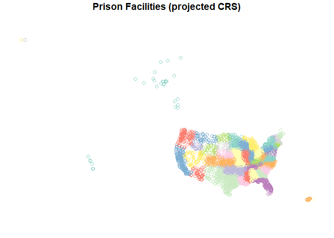
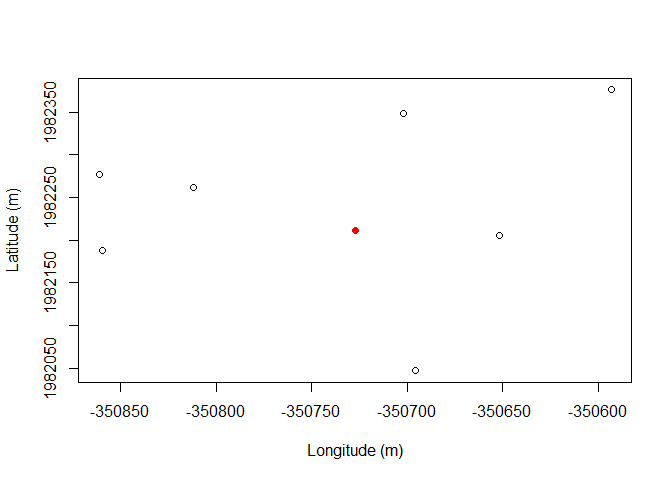

Prison mapping step 1: get points
================
2019-09-01

  - [Description](#description)
  - [0 - Load packages](#load-packages)
  - [I - Get data](#i---get-data)
  - [II - Calculate distances, create centroids and
    groups](#ii---calculate-distances-create-centroids-and-groups)

### Description

Get polygon center points, calculate distances, and get group center
points.

### 0 - Load packages

``` r
library(sf)
library(nngeo)
library(dplyr)
library(readr)
```

### I - Get data

  - Filtered out Juvenile and Closed facilities

<!-- end list -->

``` r
prison_bdys <- st_read("../../data/gis/prison_bdys.geojson", 
                       stringsAsFactors = FALSE, quiet = TRUE) %>% 
  filter(STATUS != "CLOSED", SECURELVL != "JUVENILE") %>% 
  select(FID:COUNTYFIPS, SECURELVL:CAPACITY)

prison_bdys
```

    ## Simple feature collection with 5112 features and 17 fields
    ## geometry type:  MULTIPOLYGON
    ## dimension:      XY
    ## bbox:           xmin: -166.5423 ymin: 13.44794 xmax: 145.708 ymax: 71.29244
    ## epsg (SRID):    4326
    ## proj4string:    +proj=longlat +datum=WGS84 +no_defs
    ## First 10 features:
    ##     FID OBJECTID FACILITYID                                        NAME
    ## 1  1002      990   10003650              BLACKBURN CORRECTIONAL COMPLEX
    ## 2  1003      991   10001476                          MORGAN COUNTY JAIL
    ## 3  1004      992   10000205                             POLUNSKY PRISON
    ## 4  1006      994   10000920     CHARLES COUNTY DETENTION CENTER / ANNEX
    ## 5  1007      995   10000110       EASTERN KENTUCKY CORRECTIONAL COMPLEX
    ## 6  1008      996   10000117            GREEN RIVER CORRECTIONAL COMPLEX
    ## 7  1009      997   10000121       WESTERN KENTUCKY CORRECTIONAL COMPLEX
    ## 8  1010      998   10000106 KENTUCKY CORRECTIONAL INSTITUTION FOR WOMEN
    ## 9  1011      999   10000107           LITTLE SANDY CORRECTIONAL COMPLEX
    ## 10 1013     1001   10000116                  NORTHPOINT TRAINING CENTER
    ##                     ADDRESS         CITY STATE   ZIP          ZIP4
    ## 1             3111 SPURR RD    LEXINGTON    KY 40511 NOT AVAILABLE
    ## 2     300 WEST COURT STREET JACKSONVILLE    IL 62650 NOT AVAILABLE
    ## 3             3872 FM 350 S   LIVINGSTON    TX 77351 NOT AVAILABLE
    ## 4            6905 CRAIN HWY     LA PLATA    MD 20646 NOT AVAILABLE
    ## 5       200 ROAD TO JUSTICE WEST LIBERTY    KY 41472 NOT AVAILABLE
    ## 6             1200 RIVER RD CENTRAL CITY    KY 42330 NOT AVAILABLE
    ## 7  374 NEW BETHEL CHURCH RD     FREDONIA    KY 42411 NOT AVAILABLE
    ## 8              3000 ASH AVE PEWEE VALLEY    KY 40056 NOT AVAILABLE
    ## 9      505 PRISON CONNECTOR   SANDY HOOK    KY 41171 NOT AVAILABLE
    ## 10       710 WALTER REED RD       BURGIN    KY 40310 NOT AVAILABLE
    ##         TELEPHONE   TYPE STATUS POPULATION     COUNTY COUNTYFIPS
    ## 1  (859) 246-2366  STATE   OPEN        591    FAYETTE      21067
    ## 2  (217) 243-4143 COUNTY   OPEN         40     MORGAN      17137
    ## 3  (936) 967-8082  STATE   OPEN       2904       POLK      48373
    ## 4   NOT AVAILABLE COUNTY   OPEN        333    CHARLES      24017
    ## 5  (606) 743-2800  STATE   OPEN       1672     MORGAN      21175
    ## 6  (270) 754-5415  STATE   OPEN        962 MUHLENBERG      21177
    ## 7  (270) 388-9781  STATE   OPEN        677       LYON      21143
    ## 8  (502) 241-8454  STATE   OPEN        719     SHELBY      21211
    ## 9  (606) 738-6133  STATE   OPEN       1001    ELLIOTT      21063
    ## 10 (859) 239-7012  STATE   OPEN       1237      BOYLE      21021
    ##        SECURELVL CAPACITY                       geometry
    ## 1        MINIMUM      594 MULTIPOLYGON (((-84.53814 3...
    ## 2  NOT AVAILABLE       65 MULTIPOLYGON (((-90.23213 3...
    ## 3        MAXIMUM     2984 MULTIPOLYGON (((-95.01564 3...
    ## 4  NOT AVAILABLE      490 MULTIPOLYGON (((-76.9842 38...
    ## 5         MEDIUM     1674 MULTIPOLYGON (((-83.27178 3...
    ## 6         MEDIUM      947 MULTIPOLYGON (((-87.11309 3...
    ## 7         MEDIUM      670 MULTIPOLYGON (((-88.04034 3...
    ## 8        MAXIMUM      691 MULTIPOLYGON (((-85.45774 3...
    ## 9         MEDIUM      987 MULTIPOLYGON (((-83.08295 3...
    ## 10        MEDIUM     1226 MULTIPOLYGON (((-84.74821 3...

  - Some stats

<!-- end list -->

``` r
table(prison_bdys$STATUS, prison_bdys$TYPE)
```

    ##                
    ##                 COUNTY FEDERAL LOCAL MULTI NOT AVAILABLE STATE
    ##   NOT AVAILABLE    160       0    44     0            19    10
    ##   OPEN            2923     250   236    30             3  1437

``` r
table(prison_bdys$STATUS, prison_bdys$SECURELVL)
```

    ##                
    ##                 CLOSE MAXIMUM MEDIUM MINIMUM NOT AVAILABLE
    ##   NOT AVAILABLE     1       4      5      18           205
    ##   OPEN            157     906    546     727          2543

### II - Calculate distances, create centroids and groups

  - Work in a projected coordinate system
    ([EPSG:2163](https://epsg.io/2163))

<!-- end list -->

``` r
prison_ctrs <- prison_bdys %>% 
  st_transform(crs = 2163) %>% 
  st_centroid()

st_crs(prison_ctrs)
```

    ## Coordinate Reference System:
    ##   EPSG: 2163 
    ##   proj4string: "+proj=laea +lat_0=45 +lon_0=-100 +x_0=0 +y_0=0 +a=6370997 +b=6370997 +units=m +no_defs"

  - Visualize extent

<!-- end list -->

``` r
plot(prison_ctrs["STATE"], key.pos = NULL, 
     main = "Prison Facilities (projected CRS)")
```

<!-- -->

1.  Calculate nearest distances, add to prison\_ctrs data frame

<!-- end list -->

  - *(For potential later use: e.g., identifying relatively isolated
    facilities \> some cutoff distance)*

<!-- end list -->

``` r
nearest_1 <- st_nn(prison_ctrs, prison_ctrs, k = 2, returnDist = TRUE)

nearest_1_id <- nearest_1[["nn"]]
nearest_1_id <- do.call(rbind, nearest_1_id)[,2]
nearest_1_facid <- prison_ctrs[nearest_1_id, ]$FACILITYID
nearest_1_facid <- data.frame(nearest_1_id, nearest_1_facid, stringsAsFactors = FALSE)

nearest_1_dist <- nearest_1[["dist"]][,2]
nearest_1_dat <- cbind(nearest_1_facid, nearest_1_dist)

prison_ctrs <- st_sf(data.frame(prison_ctrs, nearest_1_dat))
```

2.  Make groups based on hierarchical clustering, for aggregating near
    points to get a centroid (reduces the number of images since some
    facilities are near/next to each other)

<!-- end list -->

  - Note there doesn’t seem to be a grouping variable for prison
    facilities even though some are clearly part of the same complex

  - Adapted from:
    <https://stackoverflow.com/questions/26540831/how-to-cluster-points-and-plot>

  - Choosing 1 km, so h = 1000

<!-- end list -->

``` r
prison_ctrs_coords <- prison_ctrs %>% st_coordinates()

dend <- hclust(dist(prison_ctrs_coords), method = "complete")

groups <- cutree(dend, h = 1000)

# number of facilities
length(groups)
```

    ## [1] 5112

``` r
# number of images (eventually)
max(groups)
```

    ## [1] 4376

``` r
prison_ctrs_coordgroups <- 
  tibble(FACILITYID = prison_ctrs$FACILITYID, 
         X = prison_ctrs_coords[,1], 
         Y = prison_ctrs_coords[,2], 
         group = groups) %>% 
  arrange(group, FACILITYID)

head(prison_ctrs_coordgroups)
```

    ## # A tibble: 6 x 4
    ##   FACILITYID        X         Y group
    ##   <chr>         <dbl>     <dbl> <int>
    ## 1 10003650   1345671.  -640034.     1
    ## 2 10001476    833755.  -535991.     2
    ## 3 10000205    480064. -1572272.     3
    ## 4 10000920   1973782.  -443664.     4
    ## 5 10000110   1458587.  -641600.     5
    ## 6 10000117   1136646.  -766247.     6

  - Loop to get bounding box center points for each group

<!-- end list -->

``` r
max_group <- max(prison_ctrs_coordgroups$group)

group_cp <- list()

for(i in 1:max_group) {
  
  pts <- prison_ctrs_coordgroups %>% filter(group == i)
  pts_sf <- st_as_sf(pts, coords = c("X","Y"))
  pts_ext <- st_bbox(pts_sf)
  pts_ext_cp <- c(mean(pts_ext[c(1, 3)]), mean(pts_ext[c(2, 4)]))
  group_cp[[i]] <- cbind(group = i, cp_X = pts_ext_cp[1], cp_Y = pts_ext_cp[2])
  
}

group_cp_df <- do.call(rbind, group_cp) %>% as_tibble()


prison_ctrs_coordgroups <- left_join(prison_ctrs_coordgroups, 
                                           group_cp_df, by = "group")
```

  - Quick test if they work

<!-- end list -->

``` r
prison_ctrs_coordgroups %>% group_by(group) %>% 
  tally() %>% arrange(-n) %>% slice(1:5)
```

    ## # A tibble: 5 x 2
    ##   group     n
    ##   <dbl> <int>
    ## 1    79     7
    ## 2   105     7
    ## 3   190     7
    ## 4  2627     7
    ## 5   126     6

``` r
# pick one, the center point should be in the middle of the facility centroids

plot(prison_ctrs_coordgroups[prison_ctrs_coordgroups$group == 79,]$Y, 
     prison_ctrs_coordgroups[prison_ctrs_coordgroups$group == 79,]$X, 
     xlab = "Longitude (m)", 
     ylab = "Latitude (m)")
points(prison_ctrs_coordgroups[prison_ctrs_coordgroups$group == 79,]$cp_Y, 
       prison_ctrs_coordgroups[prison_ctrs_coordgroups$group == 79,]$cp_X,
       col = "red", pch = 16)
```

<!-- -->

  - Export for further
work

<!-- end list -->

``` r
prison_ctrs %>% inner_join(., prison_ctrs_coordgroups, by = "FACILITYID") %>% 
  st_write("exports/prison_ctrs_groups.geojson", delete_dsn = TRUE)
```

    ## Deleting source `exports/prison_ctrs_groups.geojson' using driver `GeoJSON'
    ## Writing layer `prison_ctrs_groups' to data source `exports/prison_ctrs_groups.geojson' using driver `GeoJSON'
    ## features:       5112
    ## fields:         25
    ## geometry type:  Point

#### Next step: generating images with a basemap

<br>
