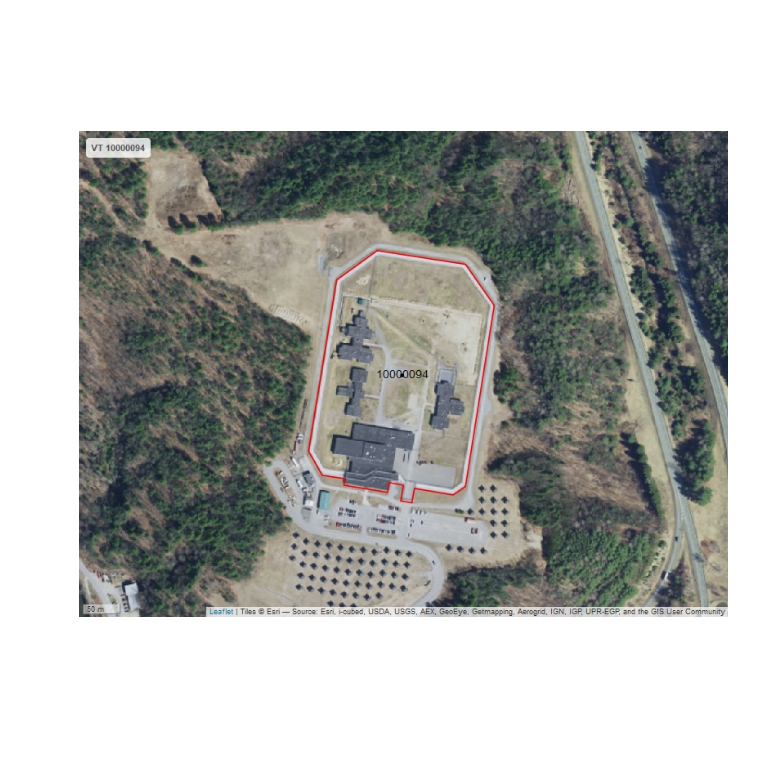

Prison mapping step 2: images export
================
2019-09-01

  - [Description](#description)
  - [0 - Load packages](#load-packages)
  - [I - Get data](#i---get-data)
  - [II - Looping for map images](#ii---looping-for-map-images)

### Description

### 0 - Load packages

``` r
library(dplyr)
library(sf)
library(tmap)
library(mapview)
library(readr)
library(fs)
```

### I - Get data

  - Filtered out Juvenile and Closed facilities

<!-- end list -->

``` r
prison_bdys <- st_read("../../data/gis/prison_bdys.geojson", 
                       stringsAsFactors = FALSE, quiet = TRUE) %>% 
  filter(STATUS != "CLOSED", SECURELVL != "JUVENILE") %>% 
  select(FID:COUNTYFIPS, SECURELVL:CAPACITY) %>% 
  st_transform(crs = 2163)

st_crs(prison_bdys)
```

    ## Coordinate Reference System:
    ##   EPSG: 2163 
    ##   proj4string: "+proj=laea +lat_0=45 +lon_0=-100 +x_0=0 +y_0=0 +a=6370997 +b=6370997 +units=m +no_defs"

``` r
st_bbox(prison_bdys)
```

    ##     xmin     ymin     xmax     ymax 
    ## -8492521 -2321919  3724108  4421398

``` r
prison_ctrs_groups <- st_read("exports/prison_ctrs_groups.geojson", 
                              stringsAsFactors = FALSE, quiet = TRUE) %>% 
  st_transform(crs = 2163)

st_crs(prison_ctrs_groups)
```

    ## Coordinate Reference System:
    ##   EPSG: 2163 
    ##   proj4string: "+proj=laea +lat_0=45 +lon_0=-100 +x_0=0 +y_0=0 +a=6370997 +b=6370997 +units=m +no_defs"

``` r
st_bbox(prison_ctrs_groups)
```

    ##     xmin     ymin     xmax     ymax 
    ## -8492496 -2321894  3723915  4421325

### II - Looping for map images

  - Doing these state by state (by state code), could implement
    differently but there are a lot of images to generate so taking time
    to examine more manageable subsets of them

<!-- end list -->

``` r
# the 50 states
sort(state.abb)
```

    ##  [1] "AK" "AL" "AR" "AZ" "CA" "CO" "CT" "DE" "FL" "GA" "HI" "IA" "ID" "IL"
    ## [15] "IN" "KS" "KY" "LA" "MA" "MD" "ME" "MI" "MN" "MO" "MS" "MT" "NC" "ND"
    ## [29] "NE" "NH" "NJ" "NM" "NV" "NY" "OH" "OK" "OR" "PA" "RI" "SC" "SD" "TN"
    ## [43] "TX" "UT" "VA" "VT" "WA" "WI" "WV" "WY"

``` r
cat("also DC and these US territories: \n")
```

    ## also DC and these US territories:

``` r
prison_bdys %>% 
  filter(!STATE %in% state.abb) %>% .$STATE %>% 
  unique() %>% sort()
```

    ## [1] "DC" "GU" "MP" "PR" "VI"

  - Manually pick a state by modifying the group\_IDs code (here STATE
    == “VT”, small one w/relatively few facilities to speed up this
    example)

  - The loop utilizes the tmap package to make the map and convert it to
    leaflet, and the mapview package to save a webshot of it (otherwise
    the basemap will not show)

  - labeling formatting options seem to be somewhat limited, just adding
    the facility ID but would like to position it more flexibly and also
    add a shadow/mask to help it show up against all backgrounds

  - *(Experimenting with expanding the bounding box, change
    `tm_view(bbox = bdys_bbox2)` to use `bdys_bbox` to map just the
    boundary feature(s) extent)*

<!-- end list -->

``` r
stime <- Sys.time()

group_IDs <- prison_ctrs_groups %>% 
  filter(STATE == "VT") %>% 
  .$group %>% unique()


for (i in 1:length(group_IDs)) {
  prisonpoints <- prison_ctrs_groups %>% filter(group == group_IDs[i])
  prison_ids <- prisonpoints$FACILITYID
  prisonbdys <- prison_bdys %>% filter(FACILITYID %in% prison_ids)
  prison_state <- unique(prisonbdys$STATE)
  title_text <- paste(prison_state, paste0(prison_ids, collapse = " "))
  bdys_bbox <- st_bbox(prisonbdys)
  bdys_bbox2 <- st_bbox(c(bdys_bbox[1] + -100, bdys_bbox[2] + -100, 
                          bdys_bbox[3] + 100, bdys_bbox[4] + 100), 
                       crs = st_crs(2163))
  
  map <- 
    tm_view(bbox = bdys_bbox2) +
    tm_basemap(leaflet::providers$Esri.WorldImagery) + 
    tm_shape(prisonpoints) + 
    tm_dots() +
    tm_shape(prisonbdys) + 
    tm_polygons(alpha = 0, border.col = "red", lwd = 2) + 
    tm_text("FACILITYID", remove.overlap = FALSE, 
            size = 1.5, col = "black") +     
    tm_layout(title = title_text) +
    tm_scale_bar(position=c("left", "bottom"))
    lf <- tmap_leaflet(map)
    dir_create(paste0("exports/"), prison_state)
    mapshot(lf, 
            file = paste0(paste0("exports/", prison_state, "/"), 
                          prison_state, "_", group_IDs[i], ".png"),
            remove_controls = c("zoomControl", "layersControl", "homeButton"),
            zoom = 0.8)

}


prison_ctrs_groups %>% 
  filter(group %in% group_IDs) %>% 
  st_drop_geometry() %>% 
  mutate(image_name = paste0(STATE, "_", group, ".png"),
         image_path = paste0("exports/", STATE, "/", image_name)) %>% 
  write_csv(., paste0("exports/", prison_state, "/", "prisons_data_imagelinks.csv"))

etime <- Sys.time()

etime - stime
```

    ## Time difference of 56.77295 secs

  - Show an
image

<!-- end list -->

``` r
read_csv(paste0("exports/", prison_state, "/", "prisons_data_imagelinks.csv")) %>% 
  slice(nrow(.)) %>% .$image_path %>% imager::load.image() %>% 
  plot(axes = FALSE)
```

<!-- -->

<br>
